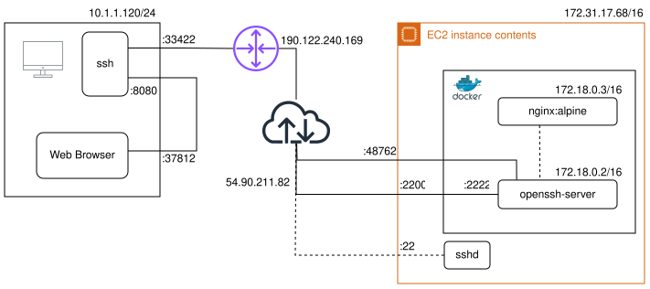

## Demo 1: `SSH Local Port Forwarding`

> Permite enrutar tráfico de forma segura desde un PC local a un servidor remoto a través de un tunel SSH

- Aplicación:
    - Acceder de forma segura a servicios internos que no están expuestos a internet

## Demo 1: Configuración local

```bash
ssh -N -i [archivo_identidad] \
    -L [puerto_local]:[host_destino]:[puerto_destino] \
    -p [puerto_ssh_remoto] \
    [usuario]@[servidor_SSH]
```

<br>

> #### Opciones:

- `-N`: no ejecutar comando remoto
- `-i`: especificar clave privada
- `-L`: [**forwardeo al puerto local**]{.underline}
- `-p`: puerto servidor SSH


## Demo 1: Diagrama de red {.smaller}


```bash {code-line-numbers="false"}
    ssh -N -i ~/.ssh/id_ed25519 -L 8080:nginx:80 -p 22000 ubuntu@54.90.211.82
```

::: {.notes}
- Localmente se configura el forwardeo
- En el navegador no hay que cambiar nada
- Solo se accede al servicio apuntado
- Dentro de la configuración del `EC2` hay que habilitar el puerto `22000`
- Abrir el navegador y mostrar `http://localhost:8080`
:::


## Demo 2: `Dynamic Port Forwarding`

> Permite enrutar cualquier tráfico de forma segura desde un PC local a una ubicación remota (similar a lo que se logra con `VPN`)

- Permite:
    - Evitar firewalls o filtros de red
    - Protección de privacidad

## Demo 2: Configuración local

```bash
ssh -N -i [archivo_identidad] \
    -D [puerto_local] \
    -p [puerto_ssh_remoto] \
    [usuario]@[servidor_SSH]
```

<br>

> #### Opciones:

- `-N`: no ejecutar comando remoto
- `-i`: especificar clave privada
- `-D`: [**servidor proxy SOCKS**]{.underline}
- `-p`: puerto servidor SSH

## Demo 2: Diagrama de red {.smaller}



```bash {code-line-numbers="false"}
    ssh -N -i ~/.ssh/id_ed25519 -D 8080 -p 22000 ubuntu@54.90.211.82
```


::: {.notes}
- Localmente se configura el forwardeo
- En el navegador hay que configurar el proxy a localhost:8080
- Acceso completo a través de la ubicación remota
- Se puede acceder al `nginx` con `172.18.0.3` o `http://nginx`
- Se puede comprobar el cambio de IP con `ipecho.net` 
:::
