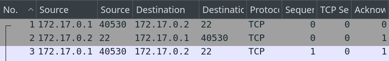
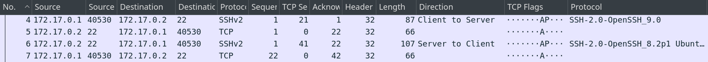
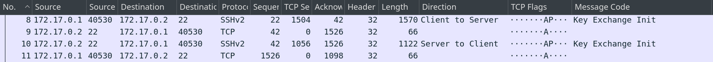
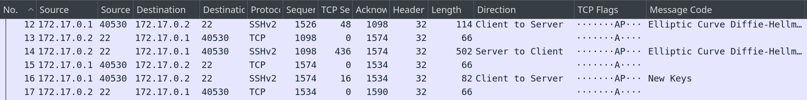

# Capa de transporte

Antes de poder cifrar la conexión, cliente y servidor negocian utilizando **texto plano**

## Inicio de la comunicación {auto-animate="true"}


::: {.columns}
::: {.column}

- [Ejemplo]{.underline}: El usuario inicia la sesión mediante el comando
```bash {code-line-numbers="false"}
    $ ssh username@host
```

<br>




:::
::: {.column}

```{mermaid}
%%| fig-align: center
---
displayMode: compact
config:
  htmlLabels: false
---


sequenceDiagram
    autonumber
    participant C as 💻 Cliente
    participant S as 🖧 Servidor

    rect rgb(31, 119, 180)
        note over C,S: Fase 1: Conexión TCP
        C->>S: SYN
        S-->>C: SYN-ACK
        C->>S: ACK
    end
```


:::
:::


## Intercambios de versión {auto-animate="true"}


::: {.columns}
::: {.column}

- Inicia el proceso de intercambio entre cliente y servidor `SSH`


:::
::: {.column}

```{mermaid}
%%| fig-align: center
---
displayMode: compact
config:
  htmlLabels: false
---


sequenceDiagram
    autonumber
    participant C as 💻 Cliente
    participant S as 🖧 Servidor

    rect rgb(44, 160, 44)
        note over C,S: Fase 2: Intercambio de versiones
        C->>S: SSH-2.0-OpenSSH_9.0
        S-->>C: SSH-2.0-OpenSSH_8.2p1
    end
```


:::
:::





## Mensajes `SSH_MSG_KEXINIT` {auto-animate="true"}


::: {.columns}
::: {.column}

- Negociación de algoritmos de:
    - Encriptación
    - Integridad
    - Compresión


:::
::: {.column}

```{mermaid}
%%| fig-align: center
---
displayMode: compact
config:
  htmlLabels: false
---


sequenceDiagram
    autonumber
    participant C as 💻 Cliente
    participant S as 🖧 Servidor

    rect rgb(214, 39, 40)
        note over C,S: Fase 3: Negociación de algoritmos
        C->>S: SSH_MSG_KEXINIT
        S-->>C: SSH_MSG_KEXINIT
    end
```


:::
:::





## Claves de cifrado {auto-animate="true"}


::: {.columns}
::: {.column}

- Se intercambia el secreto `K` y el hash `H` y se calculan las claves para encriptar la comunicación

> La sesión queda encriptada

:::
::: {.column}

```{mermaid}
%%| fig-align: center
---
displayMode: compact
config:
  htmlLabels: false
---


sequenceDiagram
    autonumber
    participant C as 💻 Cliente
    participant S as 🖧 Servidor

    rect rgb(148, 103, 189)
        note over C,S: Fase 4: Canal cifrado activo
        C->>S: SSH_MSG_NEWKEYS
        S-->>C: SSH_MSG_NEWKEYS
    end
```


:::
:::



